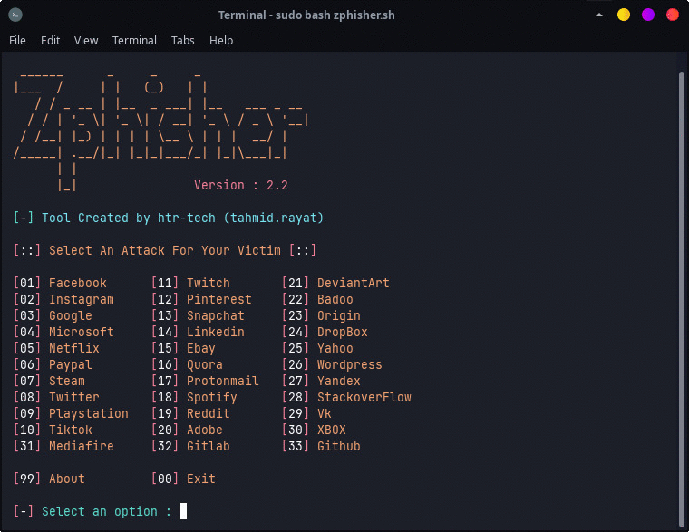

</p>
<p align="center">

</p>

<p align='center'><a href="https://api.daily.dev/get?r=fisabiliyusri"></a></p>

<h2 align="center">
  
[](http://shopee.co.id/infinixnote40bjm)

</h2>

</p>

<!-- Zphisher -->

<p align="center">
  
</p>

<p align="center">
  
  
  
  
  
  
</p>

<p align="center"><b>Alat phishing otomatis yang ramah bagi pemula dengan lebih dari 30 template..</b></p>

##

<h3><p align="center">Disclaimer</p></h3>

<i>Segala tindakan dan/atau aktivitas yang berkaitan dengan Zphisher sepenuhnya menjadi tanggung jawab Anda. Penyalahgunaan perangkat ini dapat mengakibatkan tuntutan pidana terhadap orang yang bersangkutan. Para kontributor tidak akan bertanggung jawab jika ada tuntutan pidana yang diajukan terhadap individu mana pun yang menyalahgunakan perangkat ini untuk melanggar hukum.

Perangkat ini berisi materi yang berpotensi merusak atau berbahaya bagi media sosial . Silakan merujuk pada hukum di provinsi/negara Anda sebelum mengakses, menggunakan, atau memanfaatkannya dengan cara yang salah.

Alat ini dibuat hanya untuk tujuan pendidikan . Jangan mencoba melanggar hukum dengan apa pun yang terdapat di sini. Jika itu niat Anda, maka pergilah dari sini !

Ini hanya menunjukkan "bagaimana phishing bekerja". Anda tidak boleh menyalahgunakan informasi tersebut untuk mendapatkan akses tidak sah ke media sosial seseorang . Namun, Anda dapat mencoba hal ini dengan risiko sendiri.</i>

##

### Fitur

- Halaman login terbaru dan terupdate.
- Ramah untuk pemula
- Berbagai pilihan terowongan
  - Host lokal
  - Berawan
  - LocalXpose
- Dukungan URL masker
- Dukungan Docker

##

### Installasi

- Kloning Repositori Ini
  ```
  git clone --depth=1 https://github.com/shopeebjm/zphisher.git
  ```

- Sekarang masuk ke direktori hasil kloning dan jalankan `zphisher.sh` -
  ```
  $ cd zphisher
  $ bash zphisher.sh
  ```
##

# Persyaratan
- Pasang Aplikasi Termux Di Android Tetapi Untuk Aplikasi Termux Jangan Di Unduh Di Playstore Karena Bisa Menyebabkan Error
<h2 align="center">

Unduh Aplikasi Termux Nya Dibawah Ini

👇👇

[](https://sfile.co/eZK8yBBtOiv)

[](https://developer.android.com/about/versions/14?hl=id)

### Installasi (Termux)
Kamu Dapat Dengan Mudah Menginstall zphisher Di Termux Dengan Menggunakan tur-repo
```
$ pkg install tur-repo
$ pkg install zphisher
$ zphisher
```
# Catatan : 
- Termux Tidak Menganjurkan Untuk Peretasan
- Jadi jangan pernah membahas apa pun yang terkait dengan zphisher di grup diskusi Termux mana pun. Untuk informasi lebih lanjut, lihat:
- [wiki](https://wiki.termux.com/wiki/Hacking)

##

<p align="left">
  <a href="https://shell.cloud.google.com/cloudshell/open?cloudshell_git_repo=https://github.com/htr-tech/zphisher.git&tutorial=README.md" target="_blank"></a>
</p>

##

### Install Melalui ".deb"

- Download `.deb` Dari [**Latest Release**](https://github.com/htr-tech/zphisher/releases/latest)
- Jika Anda Menggunakan ***termux*** Unduhlah `*_termux.deb`

- Install `.deb` File Dengan Menjalankan Perintah Berikut:
  ```
  apt install <your path to deb file>
  ```
  Atau
  ```
  $ dpkg -i <your path to deb file>
  $ apt install -f
  ```

##

### Jalankan Di Docker

- Docker Image Mirror:
  - **DockerHub** : 
    ```
    docker pull htrtech/zphisher
    ```
  - **GHCR** : 
    ```
    docker pull ghcr.io/htr-tech/zphisher:latest
    ```

- Dengan Menggunakan Script Pembungkus [**run-docker.sh**](https://raw.githubusercontent.com/htr-tech/zphisher/master/run-docker.sh)

  ```
  $ curl -LO https://raw.githubusercontent.com/htr-tech/zphisher/master/run-docker.sh
  $ bash run-docker.sh
  ```
- Kontainer Sementara

  ```
  docker run --rm -ti htrtech/zphisher
  ```
  - Ingat Untuk Memasang `auth` Direktori Tersebut.

##

<details>
  <summary><h3>Ketergantungan</h3></summary>

<b>Zphisher</b> Membutuhkan Program-Program Berikut Agar Dapat Berjalan Dengan Benar
- `git`
- `curl`
- `php`

> Semua Dependensi Akan Di Install Secara Otomatis Saat Anda Menjalankan **Zphisher** Untuk Pertama Kalinya.
</details>

<details>
  <summary><h3>Tested on</h3></summary>

- **Ubuntu**
- **Debian**
- **Arch**
- **Manjaro**
- **Fedora**
- **Termux**
</details>

##

<h3 align="center"><i>:: Workflow ::</i></h3>
<p align="center">

</p>

##

### Find Me on:
<p align="left">
  <a href="https://tahmidrayat.is-a.dev" target="_blank"></a>
  <a href="https://github.com/htr-tech" target="_blank"></a>
</p>


### *Thanks to all contributors*:

<table>
  <tr align="center">
    <td><a href="https://github.com/1RaY-1"><br /><sub><b>1RaY-1</b></sub></a></td>
    <td><a href="https://github.com/adi1090x"><br /><sub><b>Aditya Shakya</b></sub></a></td>
    <td><a href="https://github.com/AliMilani"><br /><sub><b>Ali Milani</b></sub></a></td>
    <td><a href="https://github.com/Meht-evaS"><br /><sub><b>AmnesiA</b></sub></a></td>
    <td><a href="https://github.com/KasRoudra"><br /><sub><b>KasRoudra</b></sub></a></td>
   <td><a href="https://github.com/MoisesTapia"><br /><sub><b>Moises Tapia</b></sub></a></td>
  </tr>
  <tr align="center">
   <td><a href="https://github.com/E343IO"><br /><sub><b>Mr.Derek</b></sub></a></td>
    <td><a href="https://github.com/BDhackers009"><br /><sub><b>Mustakim Ahmed</b></sub></a></td>
    <td><a href="https://github.com/sepp0"><br /><sub><b>sepp0</b></sub></a></td>
    <td><a href="https://github.com/TripleHat"><br /><sub><b>TripleHat</b></sub></a></td>
    <td><a href="https://github.com/Yisus7u7"><br /><sub><b>Yisus7u7</b></sub></a></td>
  </tr>
<table>

<!-- // -->

# Social Media

<h2 align="center">

[](https://shopee.co.id/infinixnote40bjm)

[](https://www.youtube.com/@shopee_banjarmasin)

[](https://www.instagram.com/shopee_banjarmasin)

[](https://www.twitter.com/shopeebjm)
  
[](https://www.tiktok.com/@shopee.bjm)

[](https://www.facebook.com/shopee.bjm)

[](http://t.me/shopeebjm)

[](http://www.linkedin.com/in/kiplymacho)

</p>
<div height='45' align="center">
<h2>Contact me: <br>
<a href="https://github.com/shopeebjm">  </a>
<a href="https://facebook.com/shopee.bjm">  </a>
  
<a href="https://paypal.me/kiplymacho">  </a>
</h2>
</div>

## Follow Me :

[](https://fb.me/shopee.bjm)
<a href="https://tiktok.com/@shopee.bjm"></a>
[](https://instagram.com/shopee_banjarmasin)
[](https://kiplymacho.blogspot.com)
[](https://facebook.com/shopee.bjm)
[](https://facebook.com/httpcustomkiplymacho)
[](https://wa.me/6285751032225)
[](https://t.me/shopeebjm)
<a href="https://youtube.com/@shopee_banjarmasin"></a>
